# Zero-Trust Dynamic Examination Lifecycle Framework

A secure examination backend and admin dashboard that generates randomized exams just-in-time, seals each one with a SHA-256 integrity hash, records every event in a tamper-evident audit log, and reports phone-detection incidents from a YOLO-based webcam monitor.


---

## 1. Project Overview

This project is a full-stack prototype of a secure examination lifecycle. It covers the path from storing questions to producing a verifiable exam paper, and it records security-relevant events along the way.

It has three components:

| Component | Purpose |
|---|---|
| **Backend** (FastAPI) | Authentication, RBAC, question bank, JIT exam generation, PDF generation, audit logging, incident intake |
| **Frontend** (React + Vite) | Admin dashboard for managing questions, generating exams, viewing incidents and audit logs |
| **AI Monitor** (Python + OpenCV + YOLO) | Webcam-based unauthorized object (phone) detection that reports incidents to the backend |

> This is a portfolio/learning project built to demonstrate secure system design and full-stack engineering. It is not a production exam platform. See [Limitations](#18-limitations).

## 2. Problem Statement

Traditional exam preparation has several weak points:

- Question papers are often prepared well in advance and stored in static form, which widens the window for leaks.
- There is usually no cheap way to prove that a generated paper was not altered after creation.
- Administrative actions are rarely logged in a way that exposes later tampering.
- Invigilation depends largely on manual observation.

## 3. Proposed Solution

The framework applies zero-trust-inspired ideas (verify every request, log every action, assume records may be tampered with) to the exam lifecycle:

1. **Protected API requests are authenticated** with JWT, and privileged operations require the correct role.
2. **Exams are generated just-in-time** from a question bank, with random selection, instead of being prepared as fixed papers.
3. **Each generated exam gets a SHA-256 integrity hash**, so later alteration can be detected.
4. **Every important event is written to a hash-chained audit log**, so editing or deleting past entries breaks the chain.
5. **An AI monitor detects phones via webcam** and reports incidents to the backend, which records them in the audit system.

## 4. Scope of "Zero-Trust" in This Project

This is a **portfolio/learning prototype that applies zero-trust-inspired principles**. It is not a complete zero-trust architecture. The principles it demonstrates are:

- **Authentication:** JWT-based login for protected endpoints.
- **Authorization:** role-based access control with least-privilege checks per route.
- **Least-trust assumptions:** stored records are not assumed to be unaltered.
- **Integrity verification:** SHA-256 exam hashes and a hash-chained audit log.
- **Auditability:** security-relevant actions and incidents are recorded.

Capabilities typically associated with a full zero-trust deployment (FIDO2/biometric authentication, encrypted question fragmentation, isolated execution environments, network-level controls such as TLS termination) are **not implemented**. See [Implemented vs Not Implemented](#16-implemented-vs-not-implemented).

## 5. Key Features

| Area | Implemented feature |
|---|---|
| Authentication | Admin registration and login, JWT access tokens, `/auth/me` |
| Password security | Passwords hashed with bcrypt (Passlib) |
| Access control | Role-based access control; 401 for missing authentication, 403 for wrong role, 409 for duplicate registration |
| Question bank | Full CRUD with subject and difficulty metadata |
| JIT exam generation | Filter by subject/difficulty, validate requested count, random selection, unique exam ID, timestamp |
| Integrity | SHA-256 hash computed per generated exam |
| PDF output | Exam PDF generated with ReportLab; written at runtime to `backend/generated_pdfs/` (not committed to Git) |
| Answer key | Answer key retrieval for a generated exam |
| Audit logging | Hash-chained audit log (`previous_hash` + `log_hash`) with a verification endpoint |
| AI monitoring | YOLO webcam detection of `cell phone` with a confidence threshold |
| Incident reporting | AI monitor posts `PHONE_DETECTED` incidents to FastAPI `/security/incidents`, recorded in the audit system |
| Dashboard | Login, Dashboard, Question Bank, JIT Exam Generator, Generated Exams, Security Monitor, Audit Logs |
| API documentation | Swagger/OpenAPI UI served by FastAPI at `/docs` |

## 6. System Architecture

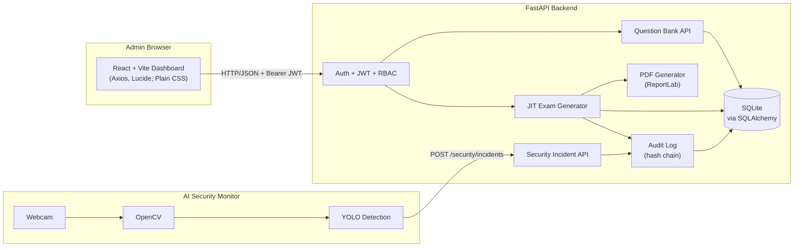

The AI monitor is a **separate process** from the admin dashboard. Admin operations and security monitoring are decoupled and communicate only through the backend API.

> **Transport note:** the diagram shows API communication conceptually. Local development uses plain **HTTP** (`http://127.0.0.1:8000` for the backend and `http://localhost:5173` for the frontend). HTTPS/TLS is **not** configured in this repository; a production deployment would terminate TLS in front of the API.

## 7. Examination Lifecycle

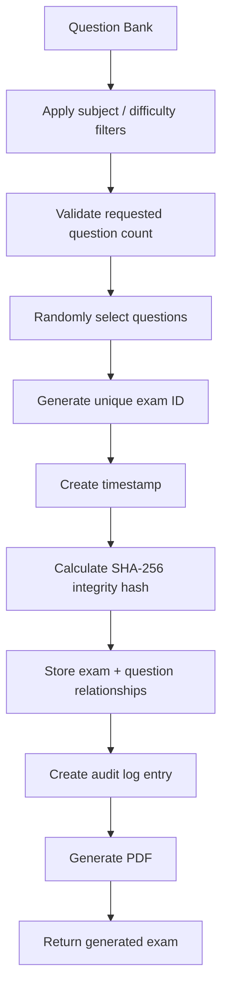

## 8. Security Model

### 8.1 Authentication (JWT)
Users log in with credentials and receive a signed JWT (`python-jose`). Protected endpoints require the token as a `Bearer` header. Requests without a valid token are rejected with **401**.

### 8.2 Role-Based Access Control
Each user has a role. Protected routes check the role from the authenticated identity, and an authenticated user with an insufficient role receives **403**.

### 8.3 Password Hashing
Passwords are never stored in plain text. They are hashed with **bcrypt** through Passlib.

### 8.4 Protected API Endpoints
Question management, exam generation, audit access and related admin operations sit behind authentication and role checks. The Swagger UI at `/docs` documents each endpoint.

### 8.5 Just-In-Time Randomized Exam Generation
Exams are assembled at request time from the question bank with random selection. No fixed paper is prepared in advance, which reduces the value of leaking any single paper.

### 8.6 SHA-256 Exam Integrity Hash
When an exam is generated, a SHA-256 hash is calculated over its identifying content and stored with it. Recomputing the hash later and comparing it to the stored value reveals whether the exam record was altered.

### 8.7 Tamper-Evident Audit Log Chain
Each audit entry stores the hash of the previous entry plus its own hash:

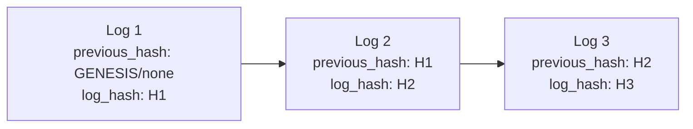

**Write flow:**

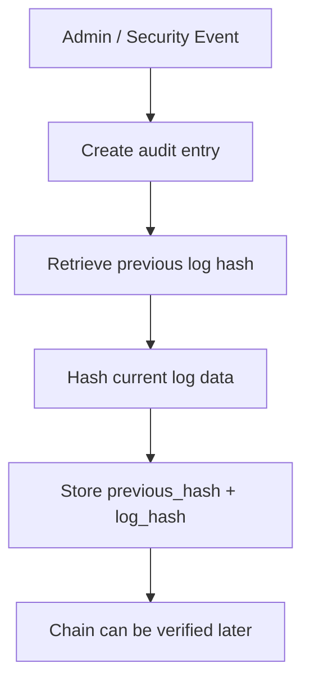

A verification endpoint walks the chain and recomputes hashes. Modifying or removing an earlier entry breaks every later link. On an untouched database it returns:

```json
{ "valid": true, "message": "Audit log chain is valid" }
```

### 8.8 AI Phone Detection and Incident Reporting

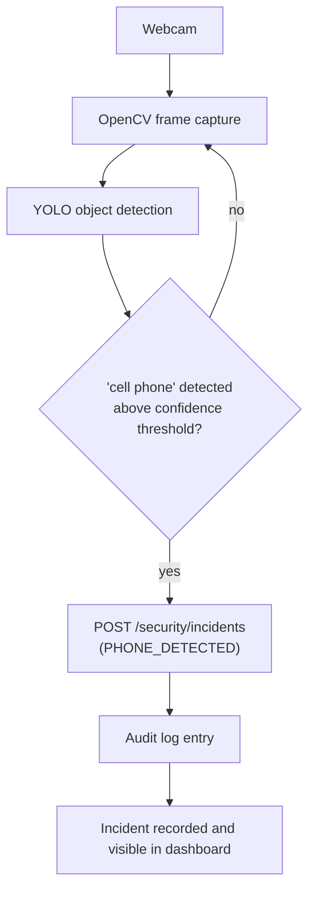

The monitor detects one class of unauthorized object: **phones**. It does not perform gaze tracking, face recognition or behavioral analysis.

### 8.9 Separation of Admin Operations and Security Monitoring
The AI monitor runs as an independent process and talks to the backend only through the incident API. The admin dashboard and the monitor do not share code or state, so a failure in one does not take down the other.

## 9. Technology Stack

| Layer | Technologies |
|---|---|
| Frontend | React, Vite, Axios, Lucide React, Plain CSS |
| Backend | Python, FastAPI, SQLAlchemy, SQLite |
| Security | JWT (python-jose), Passlib + bcrypt, SHA-256 (hashlib) |
| Documents | ReportLab (PDF generation) |
| AI Monitor | Python, OpenCV, Ultralytics YOLO (`yolo11n.pt` weights, required locally, not committed) |
| Tooling | Swagger/OpenAPI (built into FastAPI), oxlint |

## 10. Project Structure

The tree below shows what is **actually committed** to this repository:

```text
zero-trust-examination-framework/
├── ai-monitor/
│   └── security_monitor.py      # Webcam + YOLO detection + incident reporting
├── backend/
│   ├── api/
│   │   ├── __init__.py
│   │   ├── auth.py              # Registration, login, current-user endpoints
│   │   ├── questions.py         # Question CRUD, JIT exam generation, exams
│   │   ├── schemas.py           # Request/response schemas
│   │   └── security.py          # Security incident endpoints
│   ├── audit.py                 # Hash-chained audit logging
│   ├── database.py              # SQLAlchemy engine/session setup
│   ├── main.py                  # FastAPI application entry point
│   ├── models.py                # SQLAlchemy models
│   ├── pdf_generator.py         # ReportLab PDF generation
│   └── security.py              # Password hashing, JWT, auth helpers
├── frontend/
│   ├── public/
│   ├── src/                     # React components, App.jsx, CSS
│   ├── .gitignore
│   ├── .oxlintrc.json
│   ├── index.html
│   ├── package-lock.json
│   ├── package.json
│   └── vite.config.js
├── screenshots/
│   ├── audit-logs.png
│   ├── dashboard.png
│   ├── generated-exams.png
│   ├── jit-generator.png
│   ├── login.png
│   ├── question-bank.png
│   ├── security-monitor.png
│   └── swagger.png
├── docs/
├── image.png
├── .gitignore
├── LICENSE
└── README.md
```

### Repository / Runtime Files

Some files are needed or produced when the project runs locally but are **intentionally excluded from Git** via `.gitignore`. They are not part of the committed repository:

- **SQLite database** (`backend/exam_framework.db`): created locally at runtime.
- **Generated PDFs** (`backend/generated_pdfs/`): exam PDFs written at runtime.
- **YOLO model weights** (`ai-monitor/yolo11n.pt`): a binary model file required locally by the AI monitor, but not stored in this repository.
- **Demo video** (`screenshots/demo.mp4`): a large binary kept out of version control.
- **Local helper script** (`backend/update_role.py`) and local environments (`backend/venv/`, `frontend/node_modules/`).

## 11. How the System Works

1. **An admin registers and logs in.** The backend hashes the password with bcrypt and issues a JWT on login.
2. **The admin builds a question bank** through the dashboard (create, edit, delete). Each question has a subject and difficulty.
3. **The admin generates an exam.** They choose subject, difficulty and question count. The backend validates the request, selects questions randomly, assigns a unique exam ID and timestamp, computes the SHA-256 hash, stores the exam and its question links, writes an audit entry and produces a PDF.
4. **Generated exams** can be viewed and downloaded from the dashboard.
5. **The AI monitor runs separately.** When it detects a phone above the confidence threshold, it sends a `PHONE_DETECTED` incident to the backend, which records it in the audit log.
6. **The audit chain can be verified** at any time to check that no log entry has been altered.

## 12. Setup and Installation

### Prerequisites
- Python 3.10+
- Node.js 18+ and npm
- A webcam (only for the AI monitor)
- Windows PowerShell commands are shown below, since this project was developed on Windows

### Backend

```powershell
cd backend
python -m venv venv
.\venv\Scripts\Activate.ps1
pip install fastapi uvicorn sqlalchemy "python-jose[cryptography]" "passlib[bcrypt]" reportlab python-multipart
```

The SQLite database file is created locally when the backend runs; it is not included in the repository.

### Frontend

```powershell
cd frontend
npm install
```

### AI Monitor

Dependencies:

- `opencv-python`
- `ultralytics`
- `requests`

```powershell
cd ai-monitor
pip install opencv-python ultralytics requests
```

**YOLO model weights:** the monitor uses `yolo11n.pt`. This file is **not included in the repository** because it is a binary model-weight file excluded by `.gitignore`. The weights must be available locally before running the monitor: place `yolo11n.pt` in the `ai-monitor/` folder, or, if the script loads the model by name, let Ultralytics fetch the official weights on first run (requires an internet connection).

> A pinned `requirements.txt` is planned (see [Future Enhancements](#19-future-enhancements)). You can install the monitor dependencies into the same virtual environment as the backend or into a separate one.

## 13. Running the Project Locally

All local URLs use plain HTTP; HTTPS is not configured.

**1. Start the backend**

```powershell
cd backend
.\venv\Scripts\Activate.ps1
python -m uvicorn main:app --reload
```

Swagger UI: <http://127.0.0.1:8000/docs>

**2. Start the frontend** (new terminal)

```powershell
cd frontend
npm run dev
```

Dashboard: <http://localhost:5173/>

**3. Start the AI monitor** (optional, new terminal; the backend must be running and `yolo11n.pt` must be available locally)

```powershell
cd ai-monitor
python security_monitor.py
```

**4. First use:** register an admin through Swagger or the API, then log in from the dashboard.

## 14. API / Modules Overview

Full interactive documentation is available at `/docs` when the backend is running.

| Module | Responsibility |
|---|---|
| Authentication | Registration, login (JWT), `/auth/me` |
| Questions | Question CRUD, JIT exam generation, generated exam retrieval, PDF download, answer key retrieval |
| Security incidents | `POST /security/incidents` for incident intake from the AI monitor; incident listing for the dashboard |
| Audit | Audit log listing and hash-chain verification |

| Backend file | Role |
|---|---|
| `main.py` | App setup, router registration, CORS |
| `models.py` | Users, questions, exams, exam-question relationships, audit logs |
| `security.py` | Password hashing, token creation and verification, role checks |
| `audit.py` | Chain construction and verification |
| `pdf_generator.py` | Exam PDF rendering |
| `database.py` | Database engine and session management |
| `api/` | Route modules: `auth.py`, `questions.py`, `security.py`, plus `schemas.py` for request/response models |

## 15. Screenshots

| Screen | Preview |
|---|---|
| Login | 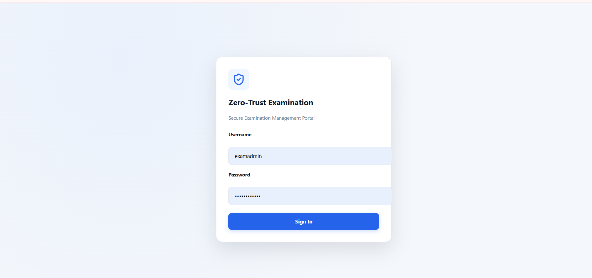 |
| Dashboard | 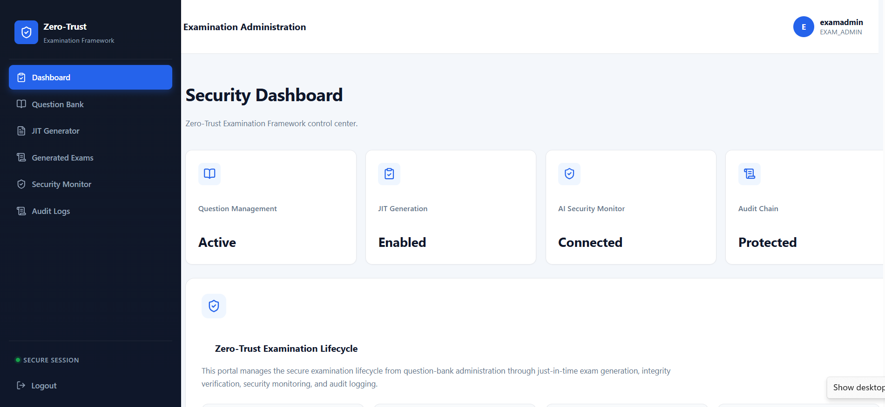 |
| Question Bank | 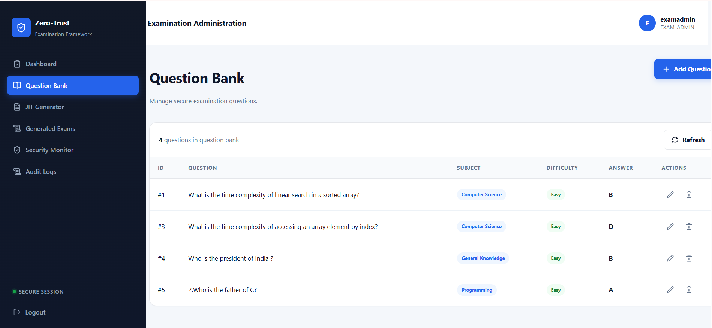 |
| JIT Exam Generator | 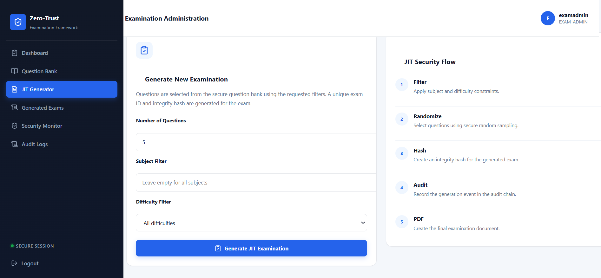 |
| Generated Exams | 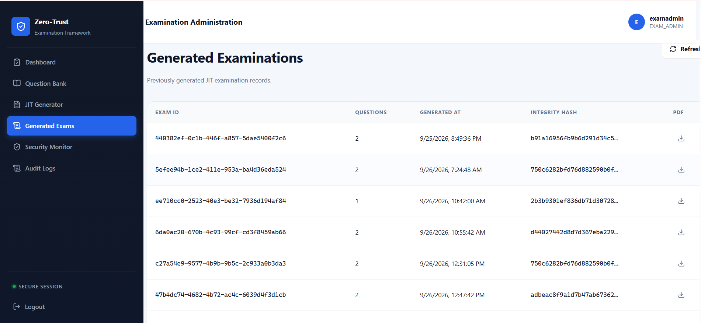 |
| Security Monitor | 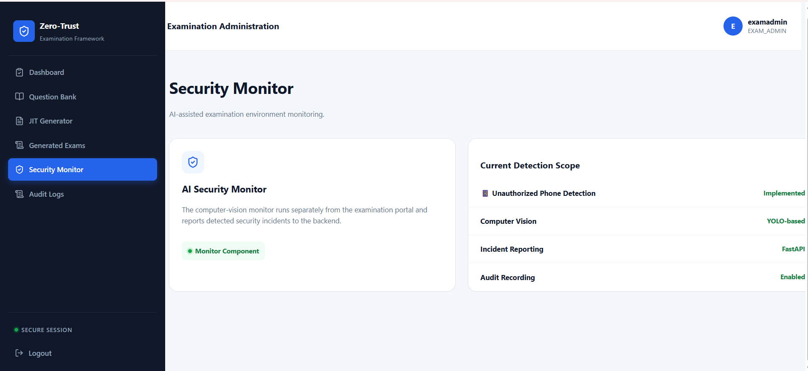 |
| Audit Logs | 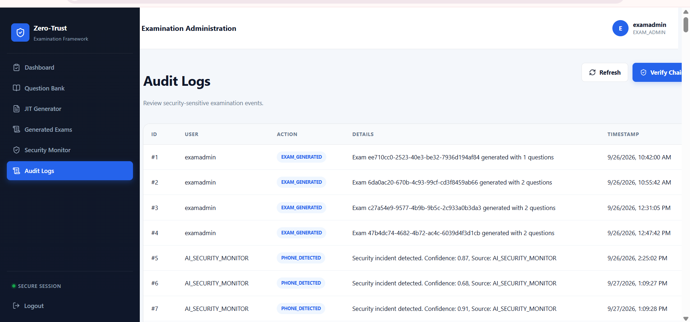 |
| Swagger API docs | 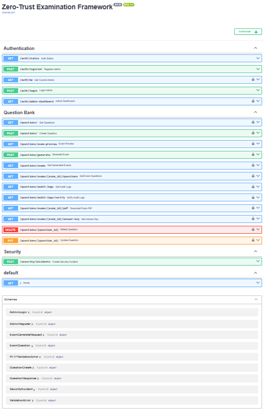 |

> A longer demo video was recorded locally but is not committed, due to its size.

## 16. Implemented vs Not Implemented

| Capability | Status |
|---|---|
| Admin registration and login | Implemented |
| JWT authentication | Implemented |
| Role-based access control | Implemented |
| bcrypt password hashing | Implemented |
| Question bank CRUD | Implemented |
| Subject / difficulty filtering | Implemented |
| JIT randomized exam generation | Implemented |
| Unique exam IDs | Implemented |
| SHA-256 exam integrity hash | Implemented |
| PDF exam generation | Implemented |
| Answer key retrieval | Implemented |
| Hash-chained audit log | Implemented |
| Audit-chain verification | Implemented |
| YOLO phone detection | Implemented |
| Incident reporting to FastAPI | Implemented |
| React admin dashboard | Implemented |
| Swagger/OpenAPI documentation | Implemented |
| FIDO2 / biometric authentication | Not implemented |
| Gaze tracking | Not implemented |
| Face recognition | Not implemented |
| Behavioral analysis | Not implemented |
| Encrypted question fragmentation | Not implemented |
| Secure isolated execution environment | Not implemented |
| PostgreSQL | Not implemented (SQLite is used) |
| Cloud deployment | Not implemented |
| Candidate-facing exam-taking interface | Not implemented |
| Automated test suite | Not implemented |

## 17. Technical Highlights

- **Security built into the workflow:** authentication, authorization, hashing and logging are part of the exam pipeline itself rather than added afterwards.
- **Tamper evidence without a blockchain:** a simple hash chain gives verifiable audit integrity using only the standard library.
- **Multi-process design:** the AI monitor is decoupled from the web app and integrates over a plain HTTP API.
- **Computer-vision integration:** a YOLO model feeds a live security event stream into a web backend.
- **Full-stack scope:** REST API, relational data model, PDF generation, ML inference and a React UI in one coherent system.

## 18. Limitations

- This is a **zero-trust-inspired prototype**, not a full zero-trust architecture. Many zero-trust components (see [Implemented vs Not Implemented](#16-implemented-vs-not-implemented)) are absent.
- Local development runs over **HTTP**; HTTPS/TLS is not configured.
- Uses **SQLite**, which is suitable for local development but not for concurrent production use.
- The audit chain is **tamper-evident, not tamper-proof**: anyone with full database access could rewrite the entire chain consistently. Anchoring the latest hash externally would address this.
- Secrets (such as the JWT signing key) are not yet managed through environment-based configuration.
- The AI monitor detects **phones only**, uses a pretrained general-purpose model, and its accuracy depends on lighting, camera angle and distance.
- The YOLO weights (`yolo11n.pt`) are not distributed with the repository and must be provided locally.
- The system covers exam **generation and monitoring**. It does not include a candidate-facing exam-taking interface.
- The framework has been tested manually; there is no automated test suite yet.
- Generated PDFs and the database are stored on the local filesystem and are not versioned.

## 19. Future Enhancements

- FIDO2 / biometric authentication for board members
- Encrypted question fragments reconstructed only at generation time
- Isolated secure execution environment for exam assembly
- PostgreSQL for production persistence
- Cloud deployment with HTTPS/TLS
- Environment-variable-based secret management
- More advanced computer vision (multi-object detection, gaze tracking, face recognition, behavior analysis)
- External anchoring or stronger persistence for the audit chain
- Candidate-facing exam-taking interface
- Production-grade monitoring and alerting
- Automated tests (pytest for the API, component tests for the UI)
- `requirements.txt` and Docker setup for reproducible installs

## 20. Author

**Afsha Siddiha**
B.Tech CSE (AI & ML), VNR VJIET, Hyderabad

- GitHub: [afshasiddiha07-design](https://github.com/afshasiddiha07-design)
- LinkedIn: [afsha-siddiha](https://www.linkedin.com/in/afsha-siddiha-518a973bb)
- Email: afshasiddiha07@gmail.com

## 21. License

This project is released under the license in the [LICENSE](LICENSE) file.